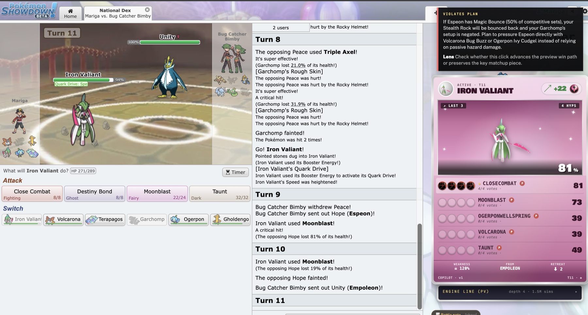
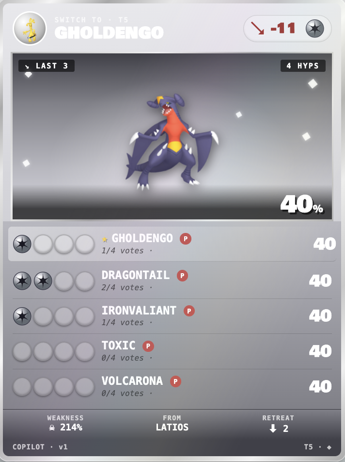
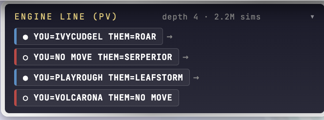
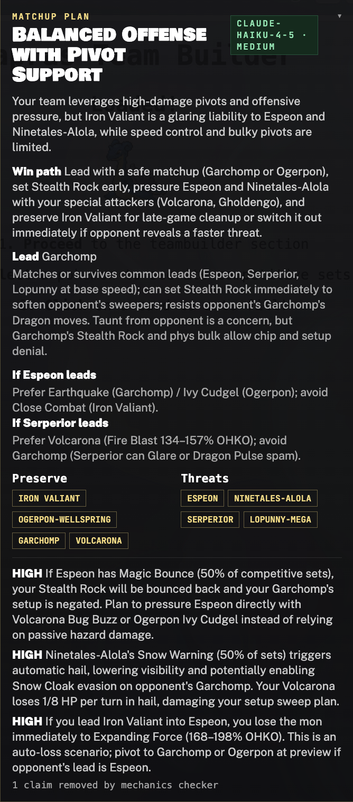
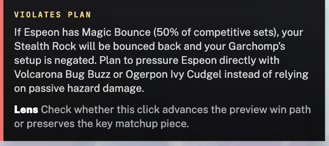
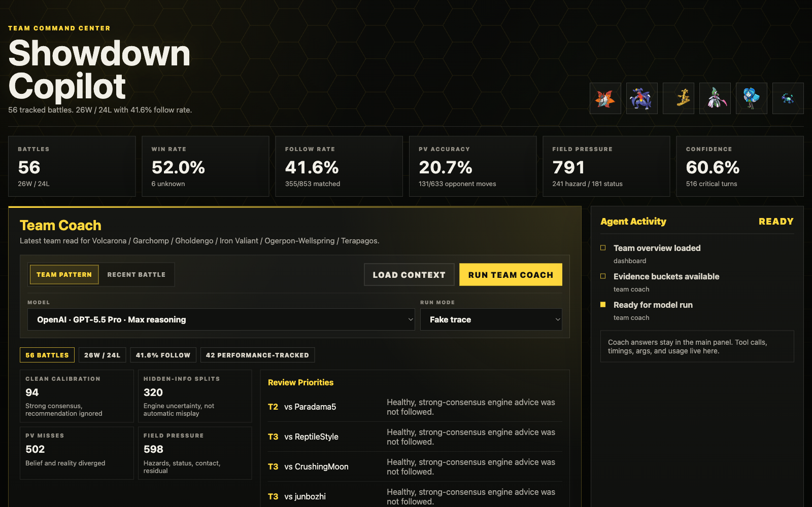

# Pokemon Showdown Copilot

A human-in-the-loop AI copilot for Pokemon Showdown singles battles (Gen 9 National Dex). It watches a live battle in the browser, tracks hidden opponent information, and produces two things: real-time move recommendations from a search engine, and an LLM-generated matchup plan that is grounded in computed game facts and checked for mechanical errors before it reaches the screen.

The project is built as a copilot, not an autoplay bot. The models are treated as signal sources for a human player, with telemetry, postmortems, and verification wrapped around them.



## Why this project is interesting

Most of the engineering value is not "it plays Pokemon." It is the system around the models:

- **Hidden-information modeling.** The proxy maintains a belief state over each opponent Pokemon (revealed moves, items, abilities, Tera type, speed range), narrows it from observed play, and samples opponent hypotheses (PIMC) so the search engine reasons over uncertainty instead of a single guessed set.
- **Grounded LLM planning.** The matchup planner does not free-associate. It receives computed facts: a damage matrix, Smogon usage priors, base-speed ordering, and hidden-forme data such as Mega evolutions. The prompt is disciplined to cite supplied numbers and never invent them.
- **Verification instead of trust.** A mechanics verifier checks the plan's type-effectiveness and ability claims against the local Pokedex. Rather than rejecting a whole plan for one bad claim, it drops the offending claim and ships the rest (sanitize-first). This turned a feature that fell back to a canned plan on every real game into one that ships real model plans.
- **Reliability debugging from real telemetry.** The system records per-battle postmortems and engine replays. That instrumentation was used to find and fix real production failures: an environment flag that let LLM reasoning eat the entire output-token budget, an output-token clamp that truncated grounded plans into invalid JSON, and a grounding blind spot where the planner used a Pokemon's base-form speed and missed its Mega form. Each fix was validated against the exact failing battle.

The last one is the clearest worked example. A recent loss came from leading a Pokemon into an opposing Mega Diancie that outsped and knocked it out on turn one. The plan had recommended that lead because the grounding fed it the base Diancie's speed of 50, not Mega Diancie's 110. After the fix, the regenerated plan for that same battle leads a different Pokemon and explicitly warns that Mega Diancie outspeeds. The finding worth noting was that a stronger model made the same mistake, which meant the failure was in the data pipeline, not the model.

## Architecture

```text
Pokemon Showdown page
        |
        v
TypeScript WXT extension            live overlay, damage matrix, page-state translation
        |
        v
Python FastAPI proxy (:7271)        this repo's core
  - belief tracking over opponents
  - Smogon usage priors, speed / Choice Scarf inference
  - PIMC hidden-information hypotheses
  - grounded matchup planner (LLM) + sanitize-first verifier
  - postmortems, annotations, dashboard API
        |
        v
Rust Axum engine (:7270)            separate repo: MCTS / PUCT, heuristic priors, forced playouts
        |
        v
Python Metamon sidecar (:7273)     separate repo: Kakuna neural policy prior at the search root
```

The Rust search engine and the neural sidecar are separate components with their own repositories. This repository is the integration and intelligence layer: the browser extension, the proxy where the belief tracking and LLM grounding and verification live, and the postgame dashboard.

## Features

**Live battle overlay.** A floating panel in the Showdown battle page showing the recommended action with per-hypothesis vote confidence (each orb is one sampled opponent hypothesis), the engine's principal variation, opponent-threat conflicts, and a team-preview matchup plan.





**Grounded matchup plan.** At team preview, a plan generated by an LLM (Claude Haiku 4.5 by default, around 30 seconds) that names a lead, a win path, threats to preserve against, per-lead rules, and forme-aware danger rules. Grounded in the damage matrix, usage priors, and hidden-forme data. The model chip shows which model produced it, and the footer counts any claims the mechanics checker removed.



**Plan-fit warnings.** During the battle, each click you are about to make is checked against the preview plan. If it violates a plan rule, the overlay says so and cites the rule.



**Postgame analytics dashboard (work in progress).** A React dashboard over saved battle postmortems: team and per-Pokemon performance, review queues, engine-uncertainty views, and LLM coach summaries. Functional but still being polished.



## Scope and limitations

Stated plainly, because being honest about scope reads better than overselling:

- Single format: Gen 9 National Dex singles. Not doubles, not other tiers.
- The search engine is a strong signal source, not a superhuman player. It loses games. It is meant to inform a human, not replace one.
- The matchup plan is advisory and takes roughly 30 seconds on the default model, which suits the team-preview window but is a heavy call for a fast decision.
- Terastallization is not yet modeled in the planner's forme reasoning.

## What I learned

- **Integrating research beats reimplementing it.** The search core is an existing MCTS/PUCT engine (poke-engine). The work was making it perform in a real system: neural priors only at the search root, heuristic-prior dampening and forced playouts so the neural prior does not starve alternatives, and opponent-side prior fixes for better move prediction.
- **Grounding a model is often more effective than upgrading it.** The Mega blind spot was fixed by feeding the planner correct forme data, which let the cheaper, faster model produce a correct plan. A more expensive model would have produced the same wrong plan.
- **Instrument first, then debug.** The postmortem and replay logging is what made the recent failures findable and fixable at all.
- **A disciplined workflow scales solo work.** Each recent feature went spec, then implementation plan, then task-by-task implementation with review. That structure is why the reliability fixes landed cleanly instead of as one-off patches.

## Running it

See [docs/DEMO.md](docs/DEMO.md) for the full runbook. In short, from `showdown-stack`:

```bash
scripts/start-demo-stack.sh
```

This starts the neural sidecar (:7273), the Rust engine (:7270), the proxy (:7271), and the extension dev server (:3000). It assumes the separate engine and sidecar components are present locally. Then load the unpacked extension from `extension/.output/chrome-mv3-dev` in Chrome and open a battle at play.pokemonshowdown.com.

The proxy and its tests run standalone. From `showdown-stack`:

```bash
uv run pytest
```

## Repository layout

| Path | What it is |
|---|---|
| `extension/` | TypeScript WXT Chrome extension: live overlay, damage matrix, page-state translation |
| `src/showdown_copilot/` | Python proxy: belief tracking, grounding, matchup planner, verifier, dashboard API |
| `dashboard-web/` | React postgame analytics dashboard |
| `tests/` | Proxy test suite |
| `docs/` | Runbook and design specs (`docs/superpowers/specs`) |
| `scripts/` | Stack launcher and offline evaluation tools |
